# Overview
A prototype built with SAP Cloud App Studio enables an event pub/sub mechanism for SAP Business ByDesign by plugging into modern cloud messaging services for side-by-side solution/extension development via an event-driven and loosely-coupled approach. <br>
<br>
Please refer to [this blog post](https://blogs.sap.com/?p=1204783) about an overview introduction to the ByDEventBridge prototype.

# Architecure and Design
## High level architecture
Architecture:
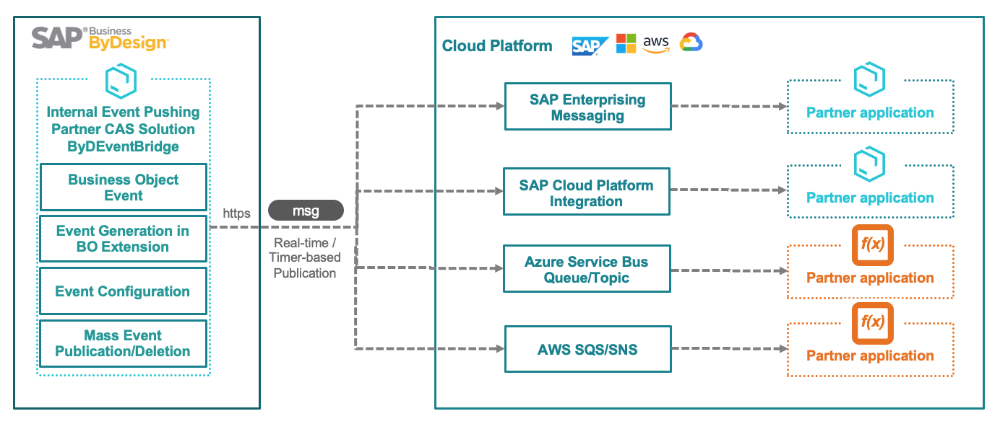
Logical Components:
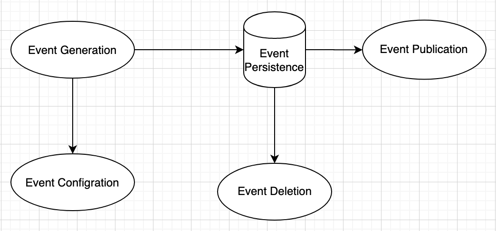

## Detail Design
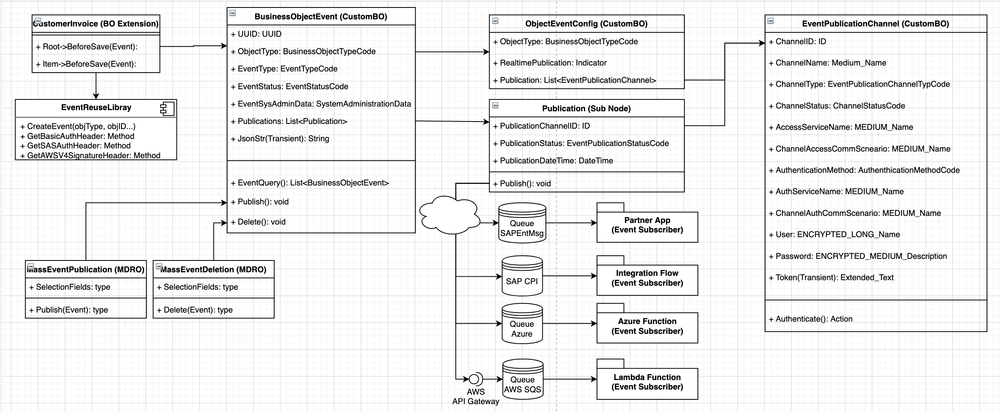

# How-to guide
## Step 1: Create your own ByDEventBridge with Cloud Application Studio
The prototype ByDEventBridge is a customer-specific solution built with SAP Cloud Application on our internal tenant, therefore it is not possible to download the package, then directly import and deploy to another tenant. And the published source code only includes BODL and ABSL files, the wizard-based artifacts are exclusive due to the fact of their strict dependence with tooling and tenant, such as UI Screen, Query, Mass Data Run, External Service Integration, Communication Scenario and Communication Arrangement etc... which require to be created or configured with your own SAP Cloud Application on your own target ByD tenant. <br>

It is recommended to create a solution template including all reusable artifacts, such as BODL file, ABSL file and Reuse Library etc which are shared in this github, then you create customer specific solution by importing the solution template.

### [Event](https://github.com/B1SA/ByDEventBridge/tree/main/src/ByDEventBridge/Event)
#### BusinessObjectEvent
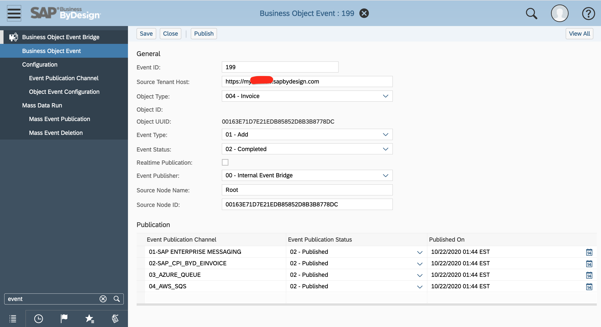

### [Event Configuration](https://github.com/B1SA/ByDEventBridge/tree/main/src/ByDEventBridge/EventConfig)
#### [EventPublicationChannel](https://github.com/B1SA/ByDEventBridge/tree/main/src/ByDEventBridge/EventConfig/EventPublicationChannel)
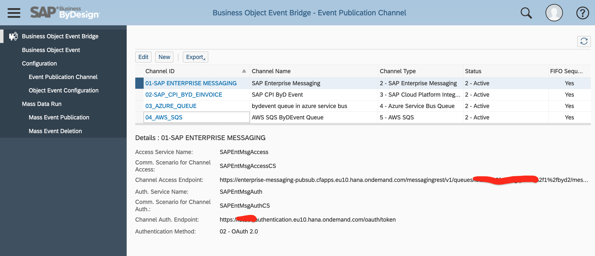

#### [ObjectEventConfig](https://github.com/B1SA/ByDEventBridge/tree/main/src/ByDEventBridge/EventConfig/ObjectEventConfig)
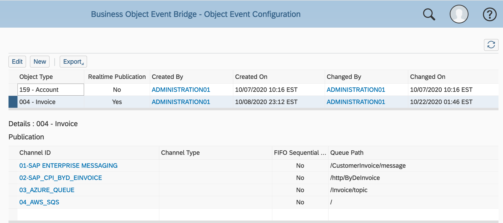

### [Event Source](https://github.com/B1SA/ByDEventBridge/tree/main/src/ByDEventBridge/EventConfig/EventSource)
In this sample, [CustomerInvoice](https://github.com/B1SA/ByDEventBridge/tree/main/src/ByDEventBridge/EventConfig/EventSource/CustomerInvoice) and Account are included as event sources through Event-BeforeSafe() of Business Object Extension.<br>

You can generate the business object event to  a standard business object or custom business object by adding the following code in the Event-BeforeSafe on the targe node of the source business object.

## Step 2: Setup your own Cloud Messaging Service
The cloud messaging service here refers to as an extenral cloud-based messaging broker. The following are supported in the prototype ByDEventBridge. You may choose one above as the messaging broker for publication of ByD events.
* SAP Cloud Platform Enterprise Messaging
* SAP Cloud Platform Integration
* Azure Service Bus
* AWS SQS

### SAP Cloud Platform Enterprise Messaging
Please refer to [this blog post](https://blogs.sap.com/2020/10/21/scp-enterprise-messaging-for-the-smbs/) about how to setup an instance SAP Cloud Platform Enterprise Messaging, and create a message queue for receiving ByD events. 
<br>As a result, you should have obtained the secret key of the instance, which includes the tokenendpoint, clientid, and clientsecret, and uri for the httprest protocol used for setting up EventPublicationChannel in step 3.
<br><br>
A sample snippet json of oa2(Oauth 2.0) for httprest protocol
```javascript
"oa2": {
        "clientid": "sb-default-abcdefghijkl....",
        "clientsecret": "abcdefg...",
        "tokenendpoint": "https://<your_instance>.authentication.eu10.hana.ondemand.com/oauth/token",
        "granttype": "client_credentials"
      },
"protocol": [
        "httprest"
      ],
"broker": {
        "type": "saprestmgw"
      },
"uri": "https://enterprise-messaging-pubsub.cfapps.eu10.hana.ondemand.com"

```
### SAP Cloud Platform Integration
Please refer to [this blog post](https://blogs.sap.com/2020/09/30/sap-cloud-platform-integration-for-sap-business-bydesign-webinar/) about how to setup an instance and create an integration flow with https adapter.

### Azure Service Bus
Please refer to [Azure Service Bus document](https://docs.microsoft.com/en-us/azure/service-bus-messaging/service-bus-quickstart-portal) about how to create and setup an Azure Service Bus namespace and a queue.
<br><br>
The following authentication methods of Azure Service Bus are supported in the prototype ByDEventBridge
* OAuth 2.0:<br>
Not tested against Azure Service Bus due to internal Azure AD permission. However, OAuth 2.0 is implemented in [source code](https://github.com/B1SA/ByDEventBridge/blob/main/src/ByDEventBridge/Event/Publication.node/Action-Publication.absl#L56) and tested against SAP Cloud Platform Enterprise Messaging.
* Shared Access Signature:<br>
Implemented in [source code](https://github.com/B1SA/ByDEventBridge/blob/main/src/ByDEventBridge/Event/Publication.node/Action-Publication.absl#L83), and tested against Azure Service Bus.<br>
It is recommended to create a policy including the Send claim for the prototype ByDEventBridge, which only allows to send the message to the queue of Azure Service Bus. As a result, you have a custom send-only policy and its primary key, which will bed used in step 3 for EventPublication setup if you are using Azure Service Bus.<br>
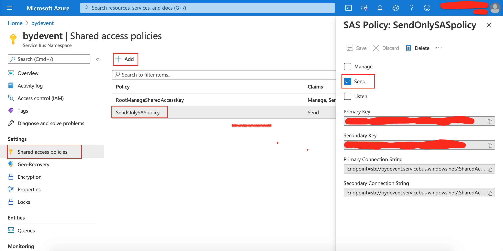

### AWS SQS
Please refer to [AWS SQS document](https://aws.amazon.com/sqs/getting-started/) about how to create and setup a SQS service and a SQS queue.

Due to [some technical limitations](https://github.com/B1SA/ByDEventBridge/blob/main/src/ByDEventBridge/ReuseLibrary/EventReuseLibrary/Function-GetAWS4SignatureKey.absl) about Hash function and HMAC function in ABSL, [AWS Signature V4](https://docs.aws.amazon.com/general/latest/gr/sigv4-signed-request-examples.html#sig-v4-examples-post) authentication for SQS is too complicated to implement with ABSL. Therefore, a custom REST API(namely ByDEventProxy-API) to send message to SQS with authentication as API Key through AWS API Gateway, which triggers a AWS Lambda function(namely ByDEventProxy) based on AWS SDK to send messages to SQS queue. Please refer to [this AWS document](https://docs.aws.amazon.com/apigateway/latest/developerguide/apigateway-getting-started-with-rest-apis.html) about Creating a REST API with Lambda integrations in Amazon API Gateway. And an API Key should be required to access the REST API, and authorisation as none. Therefore, please create a API Key for the REST API(ByDEventProxy-API) in API Gateway.<br><br>
* Configuration of the REST API(ByDEventProxy-API) in API Gateway
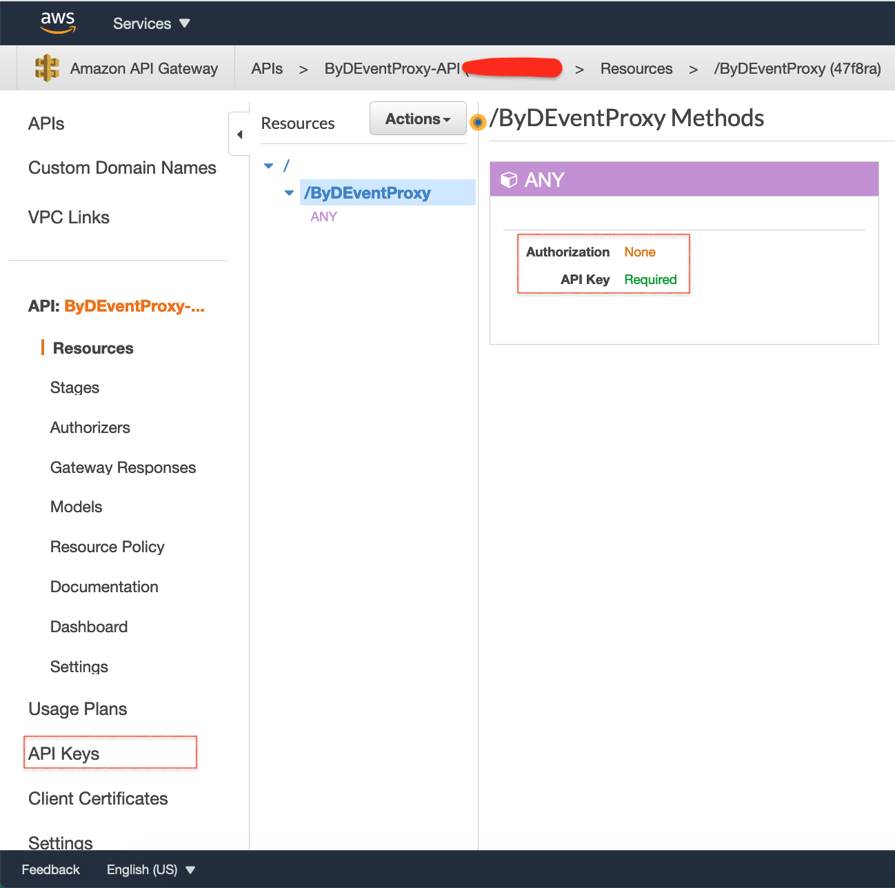<br>
* [ByDEventProxy Lambda Function Source Code(NodeJS)](https://github.com/B1SA/ByDEventBridge/blob/main/src/ByDEventBridge/EventConfig/ChannelCommunication/AWS_SQS/ByDEventProxyAPI/ProxyLambdaFunction.js)<br>
<br>
* Configuration of ByDEventProxy Lambda Function Trigger by API Gatway<br>
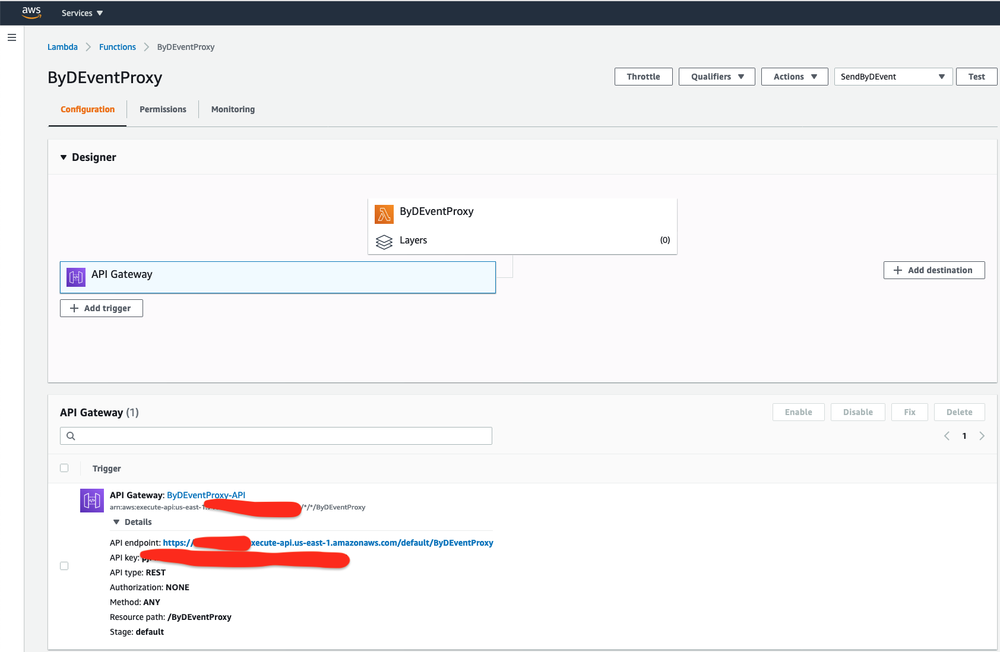<br><br>
As a result, you now should obtain the endpoint and API Key of the REST API(ByDEventProxy-API) in API GateWay to send messages to your AWS SQS queue, which will be used in Step 3 about EventPublicationChannel setup for AWS SQS.

## Step 3: Configure an EventPublicationChannel representing your Cloud Messaging Service
In this section, you will need to create External REST Service Integration(through CAS), Communication Scenario(through CAS), and Communication Arrangement(through CAS by Manage Communication Arrangemnt) for 
* Channel Authentication (How to Authenticate the access of the Channel. Only required by Channel Authentication Method as OAuth 2.0) via outbound REST HTTP call
* Channel Access (How to Publish the event message from ByD to the channel via outbound REST HTTP call). <br><br>
It is recommended to structure the artifacts of Channel Communication as [the sample here](https://github.com/B1SA/ByDEventBridge/tree/main/src/ByDEventBridge/EventConfig/ChannelCommunication).<br><br>
The service name and communication scenario of external REST service integration about Channel Authenticaiton and Channel Access will be used in the configuration of EventPublicationChannel. If you are new to Integrate an External Web Service Using REST with SAP Cloud Application Studio, please refer to [this online document](https://help.sap.com/viewer/cbcebe3cfb1647a8b0322c18dbb0b481/2020.08/en-US/7504592673e210149761cca92fcb47c4.html) for details.<br><br>
Some general tips about external REST service integration for EventPublicationChannel
* A communication system will be created automatically on the creation of the communication scenario, therefore, it is unnecessary to create a communication system for the service by manual. For example, a communication system named SAPENTMSGAUTHCS-YCNOWIADY for communication scenario SAPEntMsgAuth_CS, YCNOWIADY as the prefix of my ByDEventBridge solution in Cloud Application Studio.
* Please use Advanced setting for the technical configuration of Communication Arrangement, and select None Authentication. The actual authenticaitons are implemented in the source code via http headers.<br><br>

### SAP Cloud Platform Enterprise Messaging
#### Channel Authentication Configuraiton
* Create an External Service Integration(REST) and a Communication Scenario for then chanel authentication with SAP Cloud Application Studio, for example the service name as [SAPEntMsgAuth.wsid](https://github.com/B1SA/ByDEventBridge/tree/main/src/ByDEventBridge/EventConfig/ChannelCommunication/SAPEntMsg) and the communication scenario as SAPEntMsgAuth_CS.<br><br>
The url of channel authentication is the tokenendpoint obtained in step 2 for SAP Cloud Platform Enterprise Messaging.<br><br>
* Create a Communication Arrangement for the Communication Scenaion(SAPEntMsgAuthCS) by right clicking the communicaiton scenrio, and select "Manage Communication Arrangement".<br><br>
A communication system is automatically created on the creation of the communication scenario, therefore, it is unnecessary to create a communication system for the service by manual. For example, a communication system named SAPENTMSGAUTHCS-YCNOWIADY for communication scenario SAPEntMsgAuth_CS, YCNOWIADY as the prefix of my ByDEventBridge solution in Cloud Application Studio.<br><br>
Please use None Authentication for the Communication Arrangement.

#### Channel Access Configuraiton
* Create an External Service Integration using REST and a Communication Scenario for then channel access with SAP Cloud Application Studio, for example the service name as [SAPEntMsgAccess.wsid](https://github.com/B1SA/ByDEventBridge/tree/main/src/ByDEventBridge/EventConfig/ChannelCommunication/SAPEntMsg) and the communication scenario as SAPEntMsgAccess_CS.csd<br><br>
The url of channel access is the uri obtained in step 2 for SAP Cloud Platform Enterprise Messaging.<br><br>
* Create a Communication Arrangement for the Communication Scenaion(SAPEntMsgAuthCS) by right clicking the communicaiton scenrio, and select "Manage Communication Arrangement".<br><br>
A communication system is automatically created on the creation of the communication scenario, therefore, it is unnecessary to create a communication system for the service by manual. For example, a communication system named SAPENTMSGAUTHCS-YCNOWIADY is created for communication scenario SAPEntMsgAuth_CS, YCNOWIADY as the prefix of my ByDEventBridge solution in Cloud Application Studio.<br><br>
Please use None Authentication for the Communication Arrangement.
#### Configuration of EventPublicationChannel for SAP Cloud Platform Enterprise Messaging
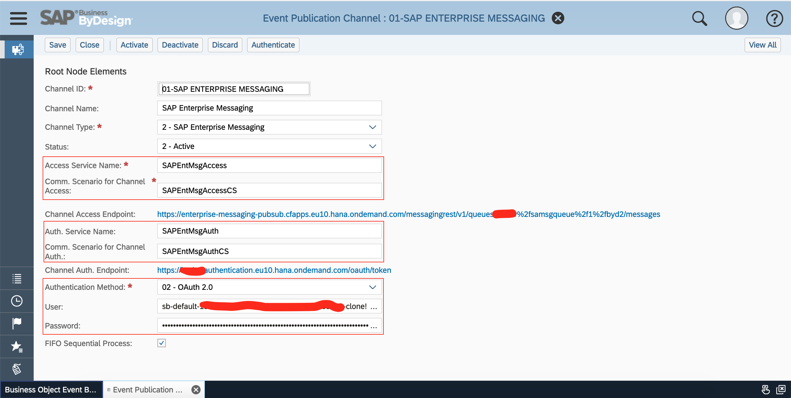

### SAP Cloud Platform Integration

#### Integration Flow Configuraiton in SAP Cloud Platform Integration
The target integration flow should be triggered by https, therefore the ByDEventBridge can send the event message to CPI by invoking an outbound https call . <br>
For example.
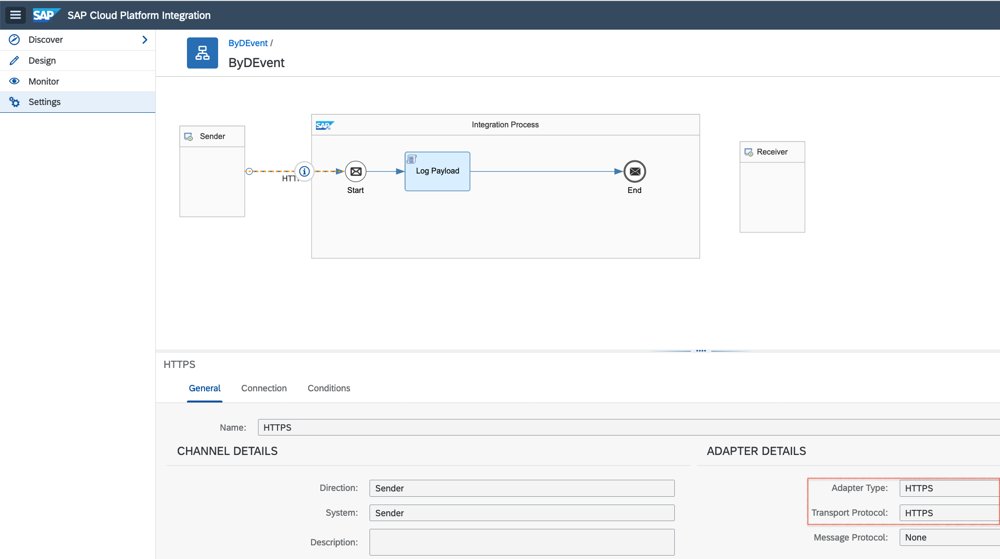
In the connection of the integration flow, you can setup the authentication as User Role, which requires a user and password(Basic Authentication) to invoke the flow via https. And the address is used as part of the endpoint to invoke the flow via https.
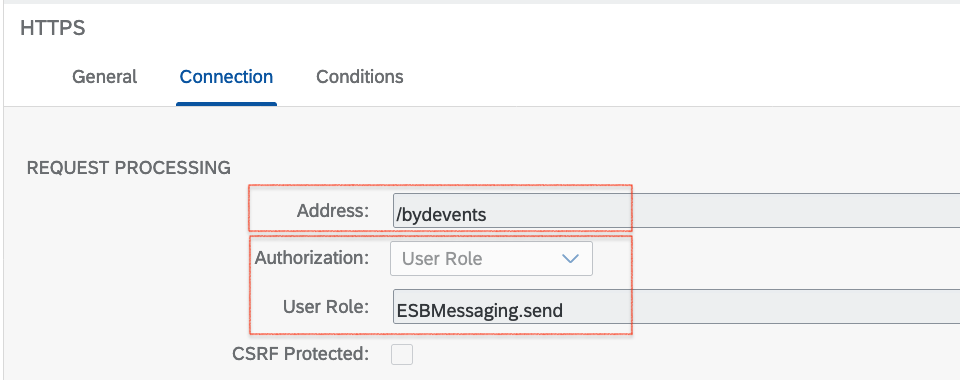

#### Channel Authentication Configuraiton in EventPublicationChannel
No separated authentication required.
#### Channel Access Configuraiton in EventPublicationChannel
* Create an External Service Integration using REST and a Communication Scenario for then channel access with SAP Cloud Application Studio, for example the service name as [SAPCPI_ByDEvents.wsid](https://github.com/B1SA/ByDEventBridge/tree/main/src/ByDEventBridge/EventConfig/ChannelCommunication/SAPCPI) and the communication scenario as SAPCPI_ByDEvents_CS.csd<br><br>
The url of channel access is the url enpoint configured in the integration flow of SAP Cloud Platform Integration.<br><br>
* Create a Communication Arrangement for the Communication Scenaion(SAPCPI_ByDEvents_CS) by right clicking the communicaiton scenrio, and select "Manage Communication Arrangement".<br><br>
A communication system is automatically created on the creation of the communication scenario, therefore, it is unnecessary to create a communication system for the service by manual. For example, a communication system named SAPCPI_ByDEvents_CS-YCNOWIADY is created for communication scenario SAPCPI_ByDEvents_CS, YCNOWIADY as the prefix of my ByDEventBridge solution in Cloud Application Studio.<br><br>
Please use None Authentication for the Communication Arrangement.

#### Configuration of EventPublicationChannel for SAP Cloud Platform 
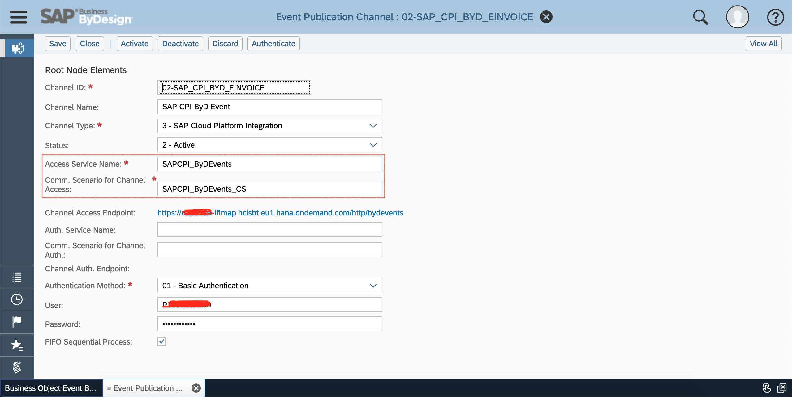

### Azure Service Bus

### AWS SQS

## Frequently Asked Questions:

### What solution type should I adopt ByDEventBridge? A Customer-Specific Solution or Solution Template or Multiple-Customer Solution?
Answer: It is recommended to create a solution template including all reusable artifacts, such as BODL file, ABSL file and Reuse Library etc which are shared in this github, then you create customer specific solution by importing the solution template. In the long run, if you think it as a good solution which you would like to resell to multiple customers, then you can request approval to create a multi customer solution, and importing the solution template. <br>

### What are the best practice for event operation?
Answer: As rules of thumb<br>
* Only generate the event on the target node of the desired object. Filter the undesired event message as early as possible.
* Be very careful to generate the event for the very low-level foundation object such as BusinessPartner and Material etc. As BusinessPartner object is depended by Employee, Account, Supplier etc.
* If it doesn't require real-time, periodical Mass Event Publication is recommended to minimize the impact on your ByD tenant.
* To reduce the size of events, the completed or obsolete events should be periodically deleted by Mass Event Deletion(Mass Data Run Object).

### What cloud-based messaging service to use?
Answer: Although, the sample prototype is cloud-messaging-service-agnostic, supporting SAP Enterprise Messaging, SAP Cloud Platform Integration, Azure Service Bus and AWS SQS. In reality, most likely one type of cloud message service is enough.It is up to your company's strategy and client's preference to pick. If the client opt-in one vendor strategy, then SAP Enterprise Messaging or SAP Cloud Platform Integration is the right choice since they have already been a SAP customer for SAP Business ByDesign. for details, you may refer to the blog posts SCP Enterprise Messaging for the SMBs by my colleague Thiago Mendes, and SAP Cloud Platform Integration for SAP Business ByDesign webinar  by Maria Trinidad MARTINEZ GEA .

### When do you need event? What granularity of messaging queue or topic and partner solution as event subscriber?
Answer: The granularity of messaging queue or topic could be per partner solution/object type/source tenant or any combination, giving the flexibility of partner solution development and operation for addressing the variety of business and security etc requirements. For instance:<br>
* Case#1: Your company(SAP Partner) would like to develop and operate an eInvoicing solution as SaaS for multiple ByD customers, it is recommended to have one queue per client for the invoice object for the separation, and also due to the fact most cloud messaging service are charged by the number of messages, not by the number of queue.  For the eInvoicing app(event subscriber) which could be multi-tenant sharing among tenant, and you may need to design a mechanism when and how-to scale. If the eInvoicing app is implemented with serverless function, then it could be dynamically scaled up or down to accommodate the client requests with ease of mind. The pricing of your SaaS now could be easily calculated by the number of messages, and the process time of messages.<br><br>
* Case#2: Your ByD client A requests an integration of warehouse activities in ByD with their in-house Warehouse Management System. Of course, the requirement could be implemented with Cloud Application Studio, OData/Web Service of SAP ByD or SAP Cloud Platform Integration etc, which it doesn't need event and additional messaging service. However, with increase of the complexity of integration and the number of systems to be integrated, an event-driven architecture becomes approperiate. In this case, you may request the client to purchase an appropriate cloud messaging service, and you will help to bridge the event in SAP ByD and integration scenario development.

# License
This ByDEventBridge prototype is released under the terms of the MIT license. See [LICENSE](LICENSE) for more information or see https://opensource.org/licenses/MIT.